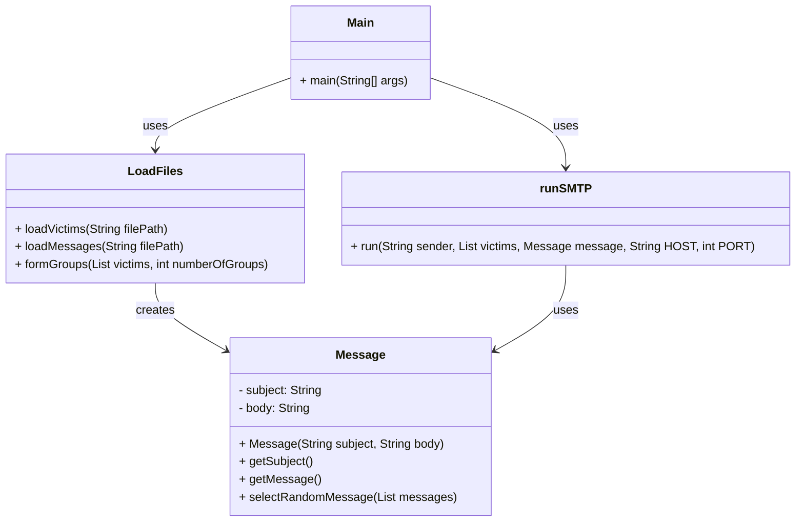

```mermaid
classDiagram
    class Main {
        + main(String[] args)
    }

    class LoadFiles {
        + loadVictims(String filePath)
        + loadMessages(String filePath)
        + formGroups(List<String> victims, int numberOfGroups)
    }

    class Message {
        - subject: String
        - body: String
        + Message(String subject, String body)
        + getSubject()
        + getMessage()
        + selectRandomMessage(List<Message> messages)
    }

    class runSMTP {
        + run(String sender, List<String> victims, Message message, String HOST, int PORT)
    }

    Main --> LoadFiles : uses
    Main --> runSMTP : uses
    LoadFiles --> Message : creates
    runSMTP --> Message : uses
```